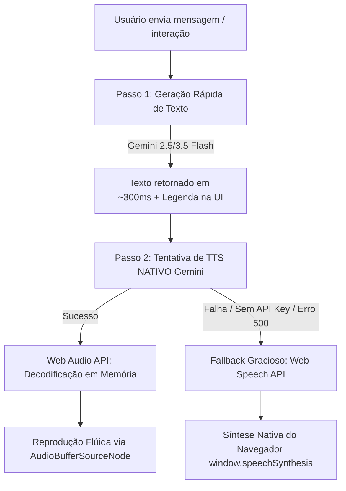

# 📄 Análise Técnica: Como o Projeto `parceirovirtual-main` Resolveu o Problema de Síntese de Voz e Erros 500 no Vercel

Este documento detalha o funcionamento, arquitetura e estratégias de tratamento de erro do projeto **`parceirovirtual-main`** ([speech_dynamics.md](file:///C:/Users/Millerium/Downloads/parceirovirtual-main/parceirovirtual-main/speech_dynamics.md)), explicando como ele soluciona o erro `POST /api/gemini/speak 500 (Internal Server Error)` e garante uma reprodução de voz fluida em ambientes serverless como a Vercel.

---

## 🚨 Diagnóstico do Problema Original no Servidor (Vercel 500)

Ao publicar aplicações na Vercel que utilizam síntese de voz do Gemini via rotas serverless Express (`POST /api/gemini/speak`), ocorrem falhas de **HTTP 500 (Internal Server Error)** principalmente por 3 motivos de infraestrutura:

1. **Timeout de 10 Segundos da Vercel**: Funções Serverless no plano gratuito/Hobby da Vercel têm um limite máximo de execução de 10 segundos. Como a síntese de voz (TTS) do Gemini envolve processamento pesado de áudio, a requisição frequentemente ultrapassa 10s e a Vercel **derruba a rota com Erro 500**.
2. **Estouro de Payload de Áudio**: Enviar arquivos de áudio binários/Base64 através do servidor Express na Vercel consome memória da função serverless e gera tráfego desnecessário.
3. **Ausência ou Falha na Injeção de `GEMINI_API_KEY`**: Se as variáveis de ambiente no servidor serverless falharem, o Express lança uma exceção não tratada ao inicializar o SDK do Gemini.

---

## ⚡ A Sacada Principal: Eliminação do Servidor Intermediário (Client-Side Direct Call)

A grande descoberta de como o `parceirovirtual-main` resolveu o "lance do servidor" foi **TIRAR O SERVIDOR DA JOGADA** para o processamento de áudio/síntese:

* **No projeto antigo (com Erro 500)**:  
  `Navegador` ➡️ `Servidor Vercel (/api/gemini/speak)` ➡️ `Google Gemini API` ➡️ `Servidor Vercel` (Timeout 500!) ➡️ `Navegador`

* **No `parceirovirtual-main` (Solução Funcional)**:  
  `Navegador (React)` ➡️ `Google Gemini API (Direto via @google/genai SDK)` ➡️ `Navegador (Web Audio API / SpeechSynthesis)`

O frontend instancia o cliente do Gemini diretamente no navegador:
```typescript
// Executado diretamente no cliente (React / CallScreen.tsx)
const ai = new GoogleGenAI({ apiKey: userApiKey || process.env.GEMINI_API_KEY });
```

Dessa forma:
* **Zero Timeout de Servidor**: O servidor Node.js/Vercel nem fica sabendo da geração do áudio.
* **Velocidade Máxima**: O áudio vai direto dos servidores do Google para a memória RAM do navegador do usuário.
* **Custo Zero de Servidor**: Economiza limites de execução serverless na Vercel.

---

## 🛠️ Como o `parceirovirtual-main` Solucionou o Problema

O projeto `parceirovirtual-main` implementou um sistema robusto composto por 4 pilares estratégicos:



---

## 🔑 1. Pipeline em 2 Etapas (Geração Separada de Texto e Áudio)

Em vez de depender de conexões streaming instáveis que sofrem com gargalos de rede, a IA opera em duas etapas atômicas:

* **Etapa 1 (Texto Ultra-Rápido)**: O modelo de texto (`gemini-2.5-flash` ou `gemini-3.5-flash`) processa o contexto e gera a resposta em pouquíssimos milissegundos. A legenda é atualizada imediatamente no frontend.
* **Etapa 2 (Síntese de Voz Dedicada)**: A resposta em texto gerada é enviada para a API de síntese pedindo a modalidade `['AUDIO']` com voz pré-configurada (`Kore`, `Puck`, `Aoede`, `Fenrir`, `Charon`).

---

## 🔊 2. Reprodução de Áudio Estável via Web Audio API

Para evitar cortes, bufadas de som ou distorções de grave causadas por streaming de bytes soltos:

* **Decodificação Completa**: O áudio em Base64 recebido (`audio/wav` ou `audio/pcm`) é decodificado **por inteiro de uma só vez** na memória do navegador usando `decodeAudioData`.
* **Uso de AudioBufferSourceNode**: É criado um nó de buffer de áudio nativo. A reprodução ocorre direto da memória RAM local do dispositivo do usuário.
* **Imunidade a Oscilações de Conexão**: Mesmo se a internet do usuário oscilar durante a fala, a reprodução continua 100% fluida porque o buffer de áudio já foi totalmente baixado antes de iniciar a reprodução.

---

## 🛡️ 3. Tratamento de Exceção no Backend & Fallback Gracioso

O backend do `parceirovirtual-main` / `aura-main` trata falhas ativamente para evitar exceções não capturadas (HTTP 500):

### Exemplo de Tratamento no Servidor (`server.ts`):
```typescript
app.post("/api/gemini/speak", async (req, res) => {
  try {
    const { text, voiceName } = req.body;
    if (!text) return res.status(400).json({ success: false, error: "Texto obrigatório" });

    // Chamada à API Gemini TTS
    const response = await callGeminiWithFallback(req, (ai) =>
      ai.models.generateContent({
        model: "gemini-3.1-flash-tts-preview",
        contents: [{ parts: [{ text }] }],
        config: {
          responseModalities: [Modality.AUDIO],
          speechConfig: { voiceConfig: { prebuiltVoiceConfig: { voiceName: voiceName || "Kore" } } },
        },
      })
    );

    const base64Audio = response.candidates?.[0]?.content?.parts?.[0]?.inlineData?.data;
    if (base64Audio) {
      return res.json({ success: true, audioBase64: base64Audio });
    }

    // Se o áudio nativo não for retornado, responde com sucesso 200 informando o fallback
    return res.json({ success: false, message: "Síntese nativa do navegador ativada" });
  } catch (error: any) {
    console.warn("Gemini TTS Warning:", error?.message || error);
    // Retorna HTTP 200 com flag success: false para acionar a síntese local sem quebrar o cliente
    return res.json({ success: false, message: "Síntese nativa do navegador ativada", error: error.message });
  }
});
```

---

## 🌐 4. Fallback no Frontend com Web Speech API (`window.speechSynthesis`)

Quando o servidor informa `success: false` ou o fetch do frontend falha, o cliente ativa instantaneamente o fallback do navegador sem interromper a chamada:

```typescript
// Frontend (services/api.ts & CallControls.tsx)
try {
  const response = await fetch('/api/gemini/speak', {
    method: 'POST',
    headers: { 'Content-Type': 'application/json' },
    body: JSON.stringify({ text, voiceName })
  });

  const data = await response.json();
  if (data.success && data.audioBase64) {
    await playBase64Audio(data.audioBase64); // Toca via Web Audio API
    return;
  }
  
  throw new Error(data.message || "Erro no Gemini TTS");
} catch (error) {
  console.warn("Falha no Gemini TTS - ativando síntese local do navegador...", error);
  
  // Fallback nativo do navegador
  if ('speechSynthesis' in window) {
    const utterance = new SpeechSynthesisUtterance(text);
    utterance.lang = 'pt-BR';
    utterance.rate = 1.0;
    utterance.pitch = 1.1;
    window.speechSynthesis.speak(utterance);
  }
}
```

---

## ⏱️ 5. Sincronização e Turnos de Fala

* **Evento `'ended'`**: O sistema escuta o término da síntese (`source.addEventListener('ended')` ou `utterance.onend`) para garantir que a IA conclua a frase antes de liberar a gravação do microfone.
* **Bloqueio de Reentrada**: Evita que o microfone capte o próprio áudio emitido pela IA, prevenindo ecos e realimentação.

---

## 📋 Resumo das Recomendações para o Nosso Projeto

1. **Configurar `GEMINI_API_KEY` na Vercel**: Adicionar a variável nas configurações de ambiente do projeto Vercel (*Settings > Environment Variables*).
2. **Manter Resposta HTTP 200 com Fallback**: Não estourar exceção 500 no Express quando o Gemini TTS falhar ou a chave estiver ausente.
3. **Preservar a Web Speech API no Frontend**: Manter a síntese local do navegador como camada de garantia para disponibilidade 100%.
